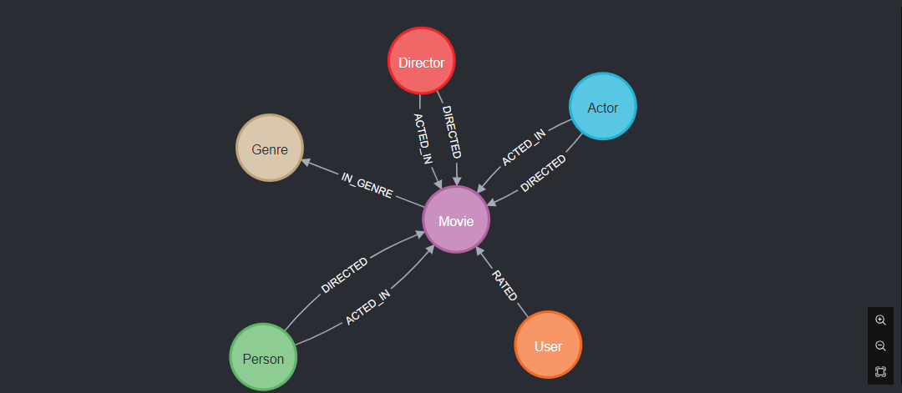

# Neo4j-Cypher
This repository contains Cypher scripts for Neo4j graph database. Explore data modeling, querying, and analysis techniques using graph databases. Discover the power of Cypher for building interconnected knowledge graphs, social networks, and more.

## Graph Visualtization of the Recommendation Movie Dataset
<centre></centre>
